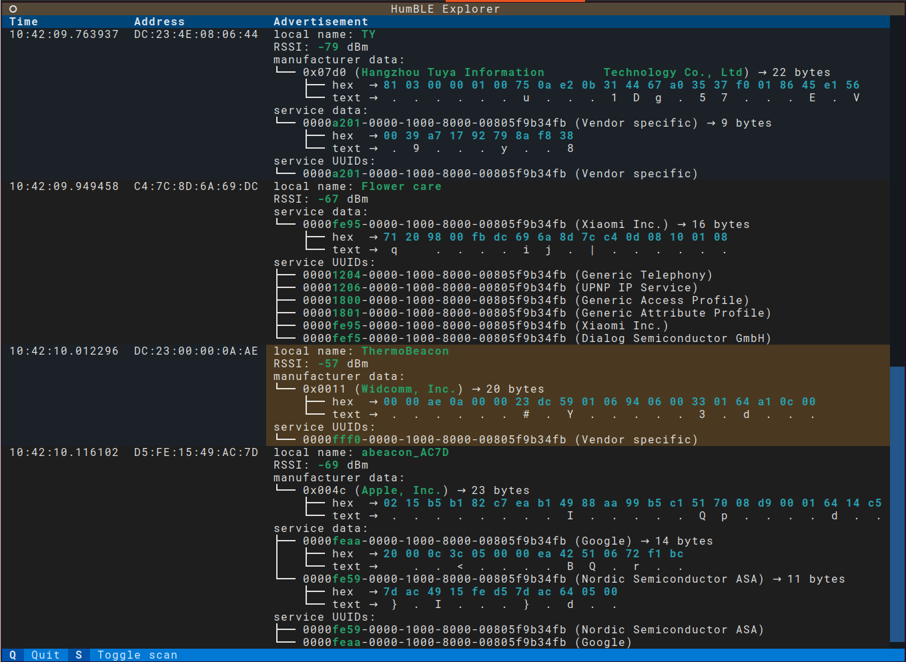

.. These are examples of badges you might want to add to your README:
   please update the URLs accordingly

    .. image:: https://api.cirrus-ci.com/github/<USER>/humble_explorer.svg?branch=main
        :alt: Built Status
        :target: https://cirrus-ci.com/github/<USER>/humble_explorer
    .. image:: https://readthedocs.org/projects/humble_explorer/badge/?version=latest
        :alt: ReadTheDocs
        :target: https://humble_explorer.readthedocs.io/en/stable/
    .. image:: https://img.shields.io/coveralls/github/<USER>/humble_explorer/main.svg
        :alt: Coveralls
        :target: https://coveralls.io/r/<USER>/humble_explorer
    .. image:: https://img.shields.io/pypi/v/humble_explorer.svg
        :alt: PyPI-Server
        :target: https://pypi.org/project/humble_explorer/
    .. image:: https://img.shields.io/conda/vn/conda-forge/humble_explorer.svg
        :alt: Conda-Forge
        :target: https://anaconda.org/conda-forge/humble_explorer
    .. image:: https://pepy.tech/badge/humble_explorer/month
        :alt: Monthly Downloads
        :target: https://pepy.tech/project/humble_explorer
    .. image:: https://img.shields.io/twitter/url/http/shields.io.svg?style=social&label=Twitter
        :alt: Twitter
        :target: https://twitter.com/humble_explorer

.. image:: https://img.shields.io/badge/-PyScaffold-005CA0?logo=pyscaffold
    :alt: Project generated with PyScaffold
    :target: https://pyscaffold.org/

|

===============
HumBLE Explorer
===============

    Human-friendly Bluetooth Low Energy Explorer

This is a cross-platform (Windows, Linux, macOS) human-friendly program to scan for Bluetooth Low Energy (BLE) advertisements on the command line. It's mostly useful for people who develop BLE software or want to debug problems with BLE devices.

Installation
============

    pip install humble-explorer

Usage
=====

    humble-explorer --help

.. _pyscaffold-notes:

Making Changes & Contributing
=============================

This project uses `pre-commit`_, please make sure to install it before making any
changes::

    pip install pre-commit
    cd humble_explorer
    pre-commit install

It is a good idea to update the hooks to the latest version::

    pre-commit autoupdate

Don't forget to tell your contributors to also install and use pre-commit.

.. _pre-commit: https://pre-commit.com/

Debugging code
==============

You can debug HumBLE Explorer with Textual's debug console.

To use the console, open up **two** terminal emulators. Run the following in one of the terminals::

    textual console

You should see the Textual devtools welcome message.

In the other console, run HumBLE Explorer with::

    TEXTUAL=devtools python3 src/humble_explorer/__main__.py

Note
====

This project has been set up using PyScaffold 4.3.1. For details and usage
information on PyScaffold see https://pyscaffold.org/.

License
=======

This project is provided by Koen Vervloesem as open source software with the MIT license. See the `LICENSE.txt`_ file for more information.
