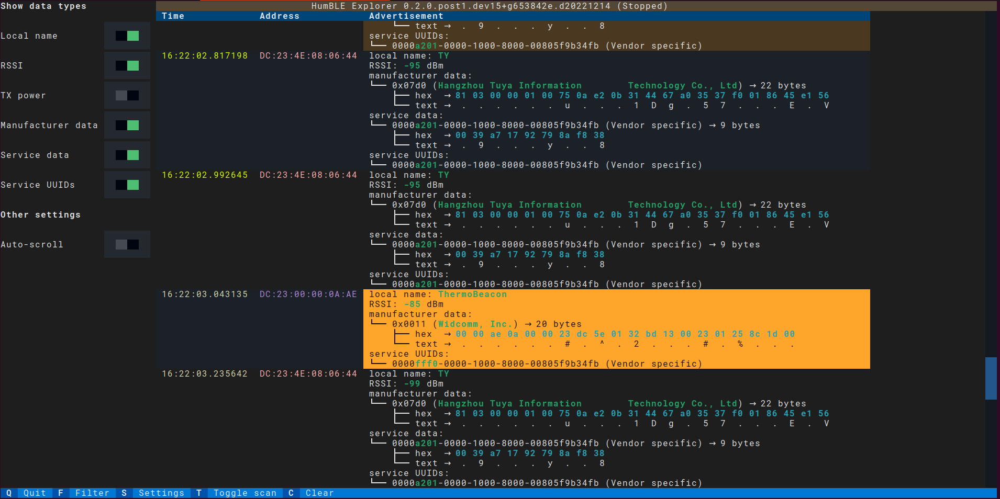

=====
Usage
=====

HumBLE Explorer runs on the command line with an interactive Text User Interface (TUI).

Installation
------------

You can install HumBLE Explorer as a pip package from PyPI::

    pip install humble-explorer

Command-line arguments
----------------------

You can find all command-line arguments by running HumBLE Explorer with the ``--help`` option:

.. code-block:: console

  $ humble-explorer  --help
  usage: humble-explorer [-h] [--version] [-a ADAPTER] [-s {active,passive}]

  Human-friendly Bluetooth Low Energy Explorer

  options:
    -h, --help            show this help message and exit
    --version             show program's version number and exit
    -a ADAPTER, --adapter ADAPTER
                          Bluetooth adapter (e.g. hci1 on Linux)
    -s {active,passive}, --scanning-mode {active,passive}
                          Scanning mode (default: active)

By default, HumBLE Explorer scans for BLE advertisements using your operating system's default Bluetooth adapter. You can change this with the ``-a ADAPTER`` option.

Also, by default HumBLE Explorer does *active scanning*. For every device the program finds, it requests extra information, with a ``SCAN_REQ`` packet directed at that device. The addressed device responds with a ``SCAN_RSP`` advertisement, which is also called *scan response data*. What data is returned for a ``SCAN_RSP`` packet depends on the type of device. It could be its device name, or manufacturer-specific data, or something else. If you want HumBLE Explorer to use *passive scanning*, use the ``-s passive`` option. The program then doesn't send ``SCAN_REQ`` packets, so devices don't respond with scan response data.

User interface
--------------

When you start HumBLE Explorer, it starts scanning for Bluetooth Low Energy advertisements and is showing them continuously in a scrollable table:

For each advertisement, the program shows columns for:

* **Time**: the time of receiving the advertisement
* **Address**: the device's Bluetooth address
* **Advertisement**: the decoded contents of the Bluetooth Low Energy advertisement

The first two colums are colored:

* Timestamps within the same second are shown in the same color.
* The same Bluetooth address is always shown in the same color.

The footer shows shortcut keys that are recognized by the program:

* Q: Quit the program
* F: Filter the devices that are shown
* S: Change settings
* T: Start or stop scan
* C: Clear all advertisements

Filtering devices
-----------------

If you press the **F** key, an input widget appears where you can start typing a device filter. Currently one type of device filter is supported: an **address filter**. For instance, if you start typing ``address=DC``, only advertisements from devices with their Bluetooth address beginning with ``DC`` are shown.

When you click outside the filter widget or press **Tab** to bring the focus to the next visible widget, the filter widget disappears, but the filter is still applied to limit the shown advertisements. Just press **F** again to change the filter, for instance by removing the filter with **Backspace** or changing the Bluetooth address part to filter on.

Changing settings
-----------------

If you press the **S** key, you can choose which advertising data types are shown in the table. By default all data types are shown, but you can enable or disable each of them individually by clicking on the checkbox or focusing it with **Tab** and then press **Enter** or **Space** to toggle it. You can also change some other settings, such as autoscrolling.

Starting and stopping the scan
------------------------------

If you press the **T** key, you stop the scan if it's running and you start the scan if it's stopped.

When the scan is running and autoscrolling is enabled in the settings, the program continuously scrolls the table with advertisements so you are always seeing the most recent results. When the scan isn't running or autoscrolling is disabled, you can scroll through the history of received advertisements with the scroll wheel, by dragging the scroll bar, or by pressing **PgUp**, **PgDown** or the arrow keys up and down when the table widget is focused.

Clearing all advertisements
---------------------------

If you press the **C** key, the program clears all received advertisements. The table is filled again with newly received advertisements.

Quitting the program
--------------------

You quit the program by pressing **Q**.
